# 📸 Instagram Clone (Full-Stack)

[](https://react.dev/)
[](https://vitejs.dev/)
[](https://nodejs.org/)
[](https://expressjs.com/)
[](https://www.mysql.com/)
[](https://socket.io/)
[](https://jwt.io/)
[](https://cloudinary.com/)
[](https://vercel.com/)
[](https://render.com/)
[](LICENSE)

A **production-ready NLP web application** for detecting and explaining hate speech using a fine-tuned Transformer model. This project demonstrates an **end-to-end ML pipeline** — from dataset handling and model training to cloud model hosting (Hugging Face) and live deployment (Streamlit).

A **full-stack Instagram clone** built with **React (Vite), Node.js + Express, MySQL**, and **Socket.IO**, featuring real-time likes, comments, follows, chat, and voice/video call signaling.

This project demonstrates how a **real production social media app** is built, deployed, and scaled using modern tools.

🚀 **Live Demo**

* **Frontend (Vercel)**
👉 [https://instagram-frontend-kohl.vercel.app](https://instagram-frontend-kohl.vercel.app/)

* **Backend API (Render)**
👉 [https://instagram-9au5.onrender.com](https://instagram-9au5.onrender.com/)

---

## 📸 Screenshots

Below are screenshots of the Instagram Clone showcasing authentication, feed, real-time interactions, messaging, calls, friendships, and mobile responsiveness.

🔐 Authentication

| Signup / Login              |
| --------------------------- |
| 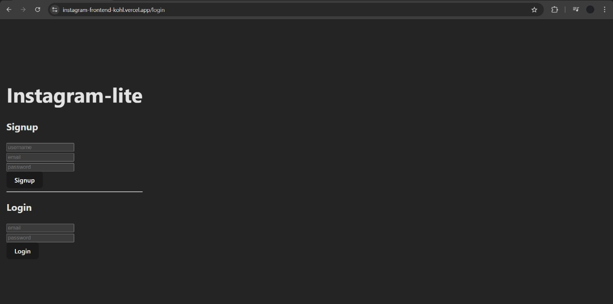 |


🏠 Feed & Posting

| Feed                        | Create Post                        |
| --------------------------- | ---------------------------------- |
| 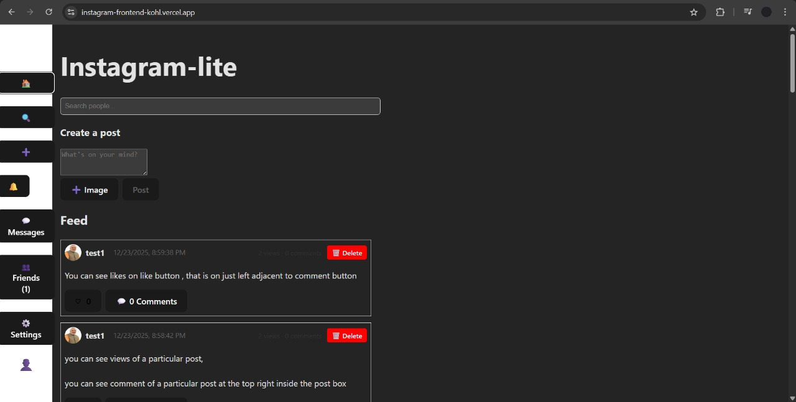 | 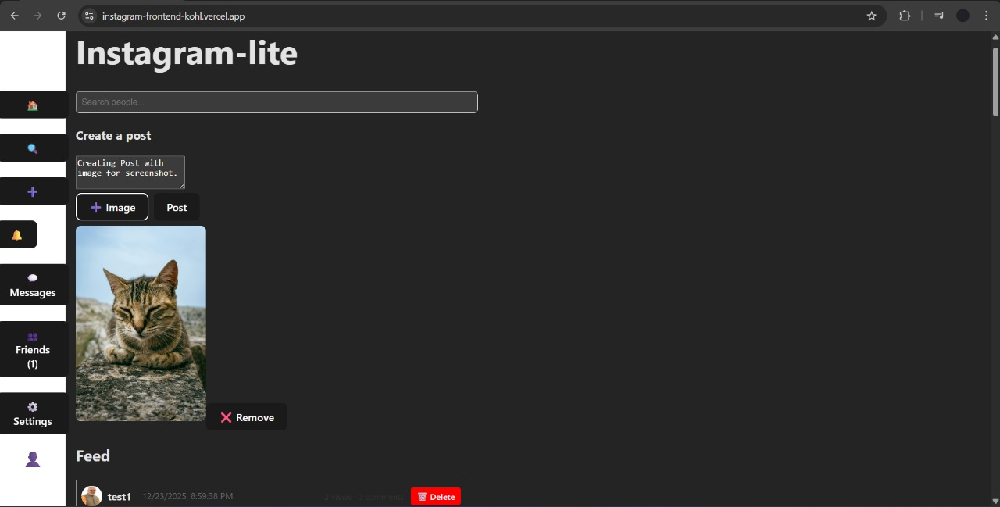 |


❤️ Post Engagement

| Engagement Details                     |
| -------------------------------------- |
| 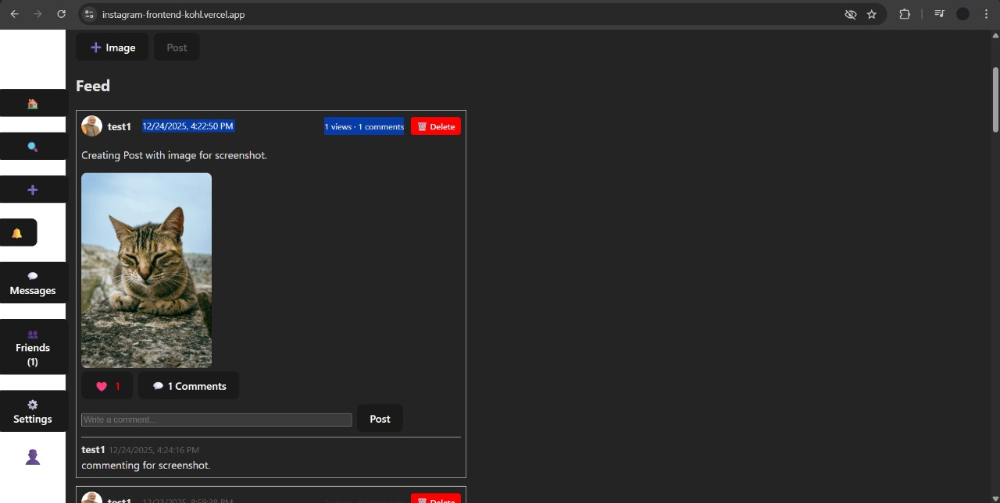 |


🔍 User Discovery

| Username Suggestions               |
| ---------------------------------- |
| 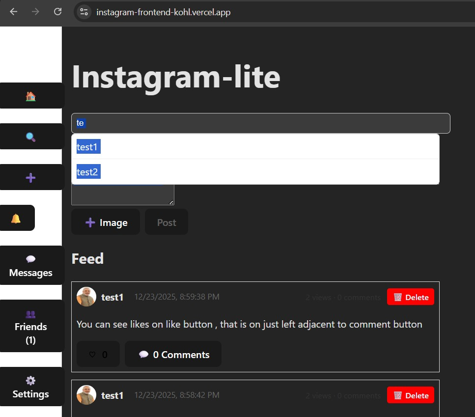 |


👤 User Profile & Social Actions

| User Profile                        | Social Actions                    |
| ----------------------------------- | --------------------------------- |
| 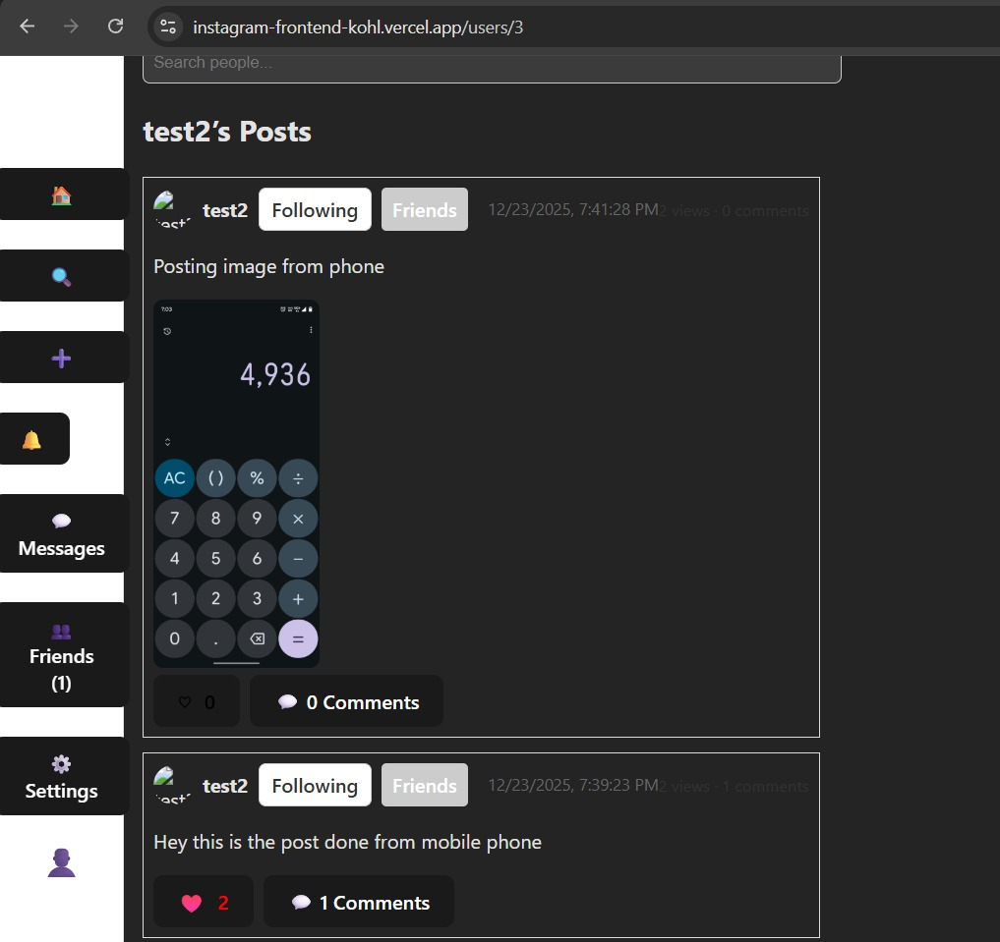 | 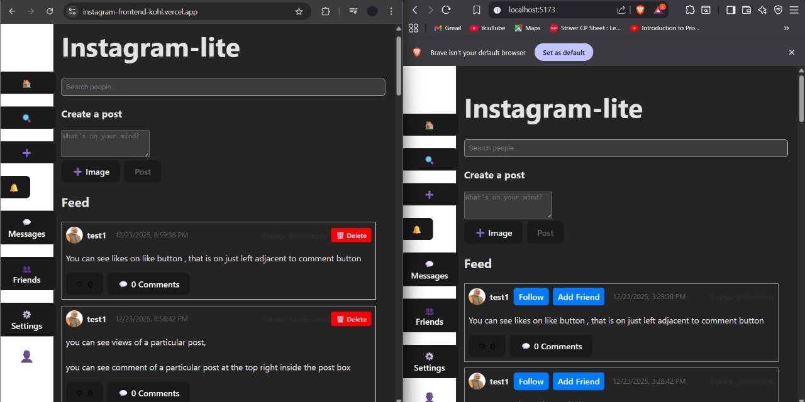 |


🤝 Friends & Requests

| Request Sent                        | Request Received                        |
| ----------------------------------- | --------------------------------------- |
| 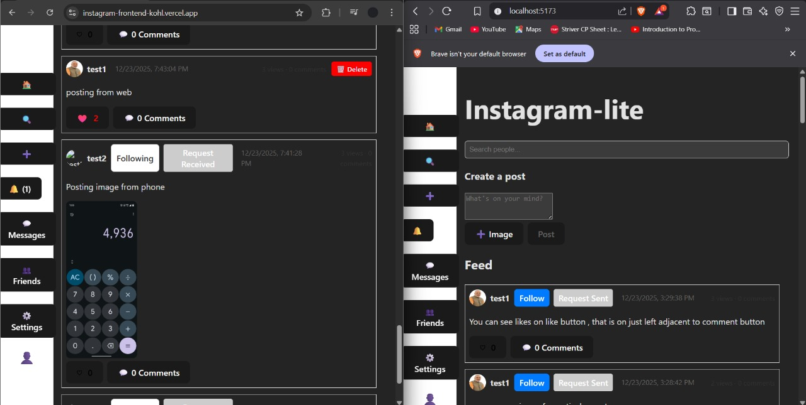 | 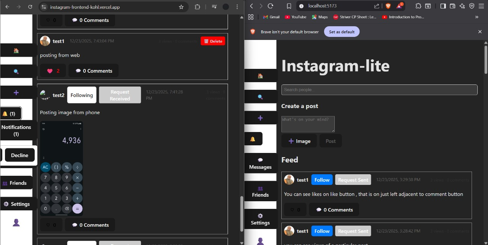 |


🧑‍🤝‍🧑 Friends List

| Friends List                        |
| ----------------------------------- |
| 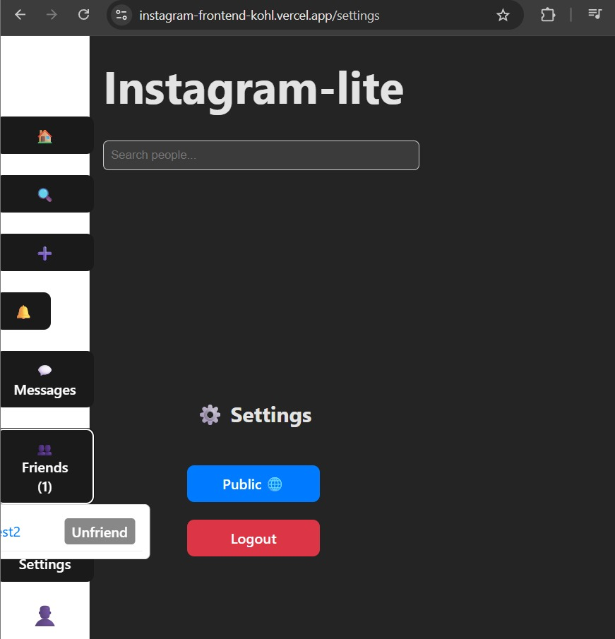 |


💬 Real-Time Messaging

| Chat Window                 |
| --------------------------- |
| 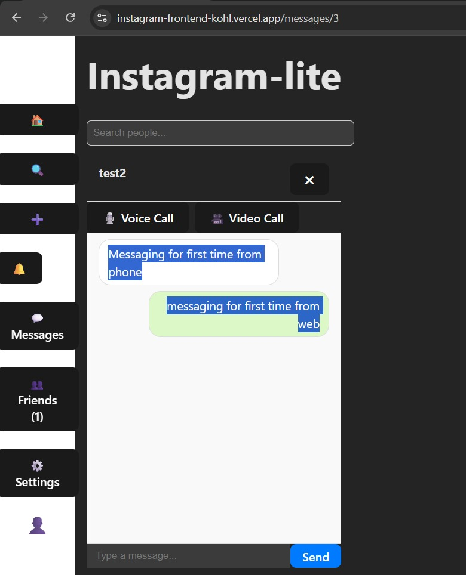 |


📞 Voice Call Flow
| Incoming Call                        | Active Call                        |
| ------------------------------------ | ---------------------------------- |
| 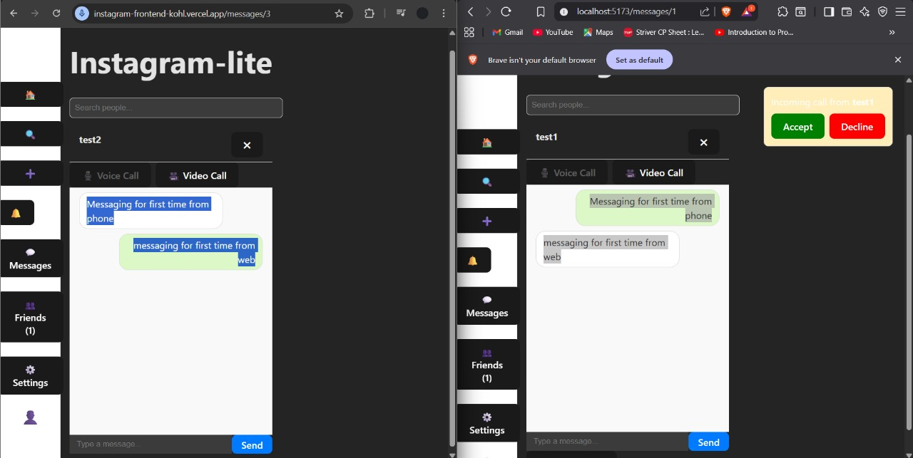 | 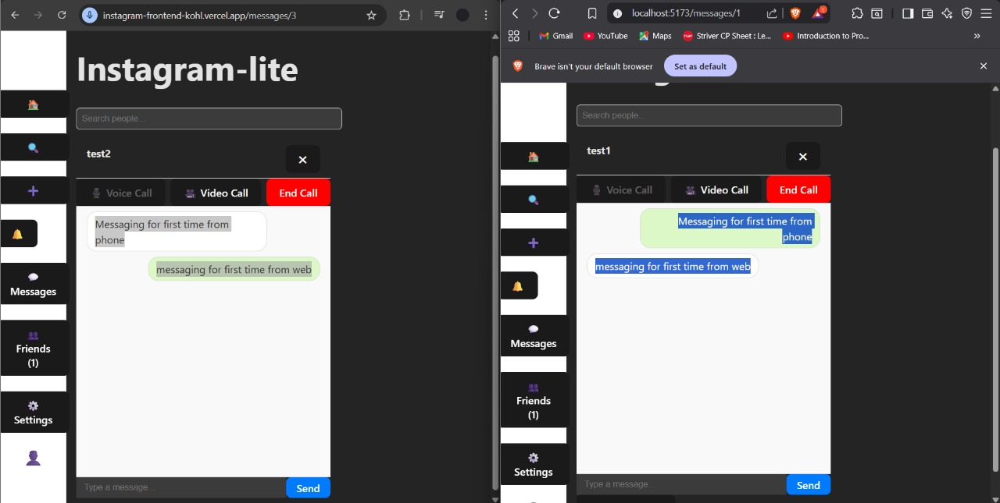 |

⚙️ Settings
| Settings                        |
| ------------------------------- |
| 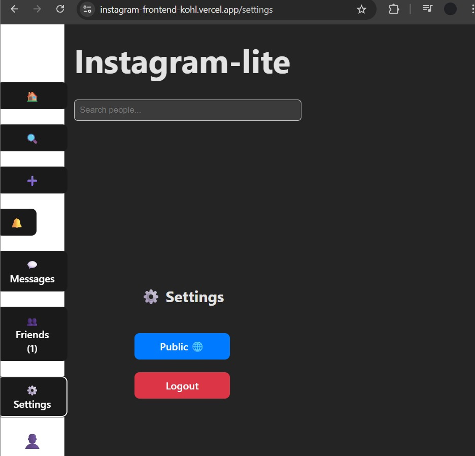 |

📱 Mobile Responsiveness

| Feed (Mobile)                         | Chat (Mobile)                         |
| ------------------------------------- | ------------------------------------- |
| 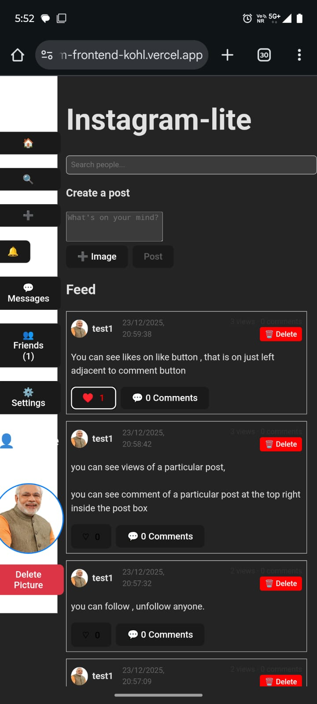 | 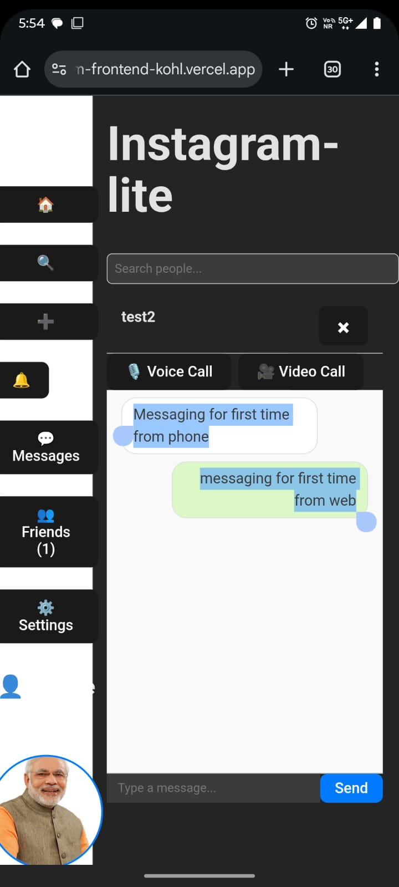 |

---

## 🧠 Architecture Overview
```
Frontend (React + Vite)  ───▶  Backend (Node.js + Express)
                                │
                                ├── MySQL (Railway)
                                ├── Cloudinary (Images & Videos)
                                ├── Socket.IO (Real-time features)
                                └── JWT Authentication
```
        

---

## ❓ Problem Statement

Modern social media platforms require **real-time interactions, scalable architectures**, and **secure authentication** to deliver a smooth user experience. Features like instant likes, comments, follows, and messaging are no longer optional — they are user expectations.

Building such systems presents several challenges:

- Maintaining **real-time consistency** across users
- Handling **authentication securely** across different domains
- Managing **media uploads** efficiently
- Ensuring **page reload routing** works correctly in SPA deployments
- Deploying and connecting **frontend, backend, and database** services reliably in production

This project aims to solve these challenges by designing and implementing a **production-ready Instagram-like social media application** using modern full-stack technologies, demonstrating how real-world social platforms are built, deployed, and maintained.

---

## ✨ Features

### 🔐 Authentication

* JWT-based authentication

* Secure HTTP-only cookies

* Login & signup system

### 🧑‍🤝‍🧑 Social Features

* Follow / Unfollow users

* Friend system

* User profiles

### 🖼️ Posts

* Create posts with images/videos

* Like & unlike posts (real-time)

* Comment on posts (real-time)

* View counts & hashtags

### 💬 Real-Time (Socket.IO)

* Live likes & unlikes

* Live comments

* Follow updates

* Chat system

* Voice / video call signaling (WebRTC-ready)

### ☁️ Media Uploads

* Cloudinary integration

* Optimized image & video storage

---

## 🧪 Engineering Journey & Optimization

This project went through multiple real-world iterations:

- Initial backend faced CORS and cookie issues in production
- Solved cross-origin authentication using `sameSite=none` and secure cookies
- Optimized Socket.IO connections to avoid duplicate listeners on re-render
- Fixed page refresh routing issues on Vercel using SPA rewrite rules
- Improved MySQL query performance using proper indexing

---

## 🚧 Engineering Challenges Solved

During the development and deployment of this project, several real-world engineering challenges were identified and resolved:

- CORS + cookies across Render ↔ Vercel
- Socket.IO auth in production
- Page reload 404 issue on Vercel
- MySQL deployment + schema init on Railway
- Real-time likes/comments sync without refresh

---

## 🛠️ Tech Stack

## Frontend

* React (Vite)

* React Router

* Axios

* Socket.IO Client

* CSS / Custom UI

## Backend

* Node.js

* Express.js

* MySQL (mysql2)

* Socket.IO

* JWT Authentication

* Multer
 
* Cloudinary SDK

## Database & Services

* MySQL – Railway

* Media Storage – Cloudinary

* Backend Hosting – Render
 
* Frontend Hosting – Vercel

---

## ✨ Features

### 🔐 Authentication

* JWT-based authentication

* Secure HTTP-only cookies

* Login & signup system

### 🧑‍🤝‍🧑 Social Features

* Follow / Unfollow users

* Friend system

* User profiles

### 🖼️ Posts

* Create posts with images/videos

* Like & unlike posts (real-time)

* Comment on posts (real-time)

* View counts & hashtags

### 💬 Real-Time (Socket.IO)

* Live likes & unlikes

* Live comments

* Follow updates

* Chat system

* Voice / video call signaling (WebRTC-ready)

### ☁️ Media Uploads

* Cloudinary integration

* Optimized image & video storage

---

## 📁 Project Structure

```
Instagram/
│
├── backend/
│   ├── controllers/
│   ├── routes/
│   ├── middleware/
│   ├── utils/
│   ├── config/
│   ├── index.js
│   └── init.sql
│
├── frontend/
│   ├── src/
│   │   ├── components/
│   │   ├── hooks/
│   │   ├── pages/
│   │   └── services/
│   ├── public/
│   └── vite.config.js
│
└── README.md

```

---

## 🔧 Environment Variables

### Backend (backend/.env)

```
PORT=5000

DB_HOST=your_railway_host
DB_PORT=12345
DB_USER=root
DB_PASSWORD=your_password
DB_NAME=your_db_name

JWT_SECRET=your_secret_key

CLOUDINARY_CLOUD_NAME=xxxx
CLOUDINARY_API_KEY=xxxx
CLOUDINARY_API_SECRET=xxxx

CLIENT_URL=https://instagram-frontend-kohl.vercel.app
```

### Frontend (Vercel Environment Variables)

```
VITE_API_BASE=https://instagram-9au5.onrender.com
VITE_SOCKET_URL=https://instagram-9au5.onrender.com
```

---

## 🗄️ Database

* MySQL hosted on Railway

* Schema initialized via init.sql

* Tables include:

  * users

  * posts

  * comments

  * likes

  * follows

  * messages

  * calls

  * hashtags

  * events

  * friend_requests

---

## 🔒 CORS & Security

* Strict CORS configuration

* Allowed origins:

  * Localhost

  * Vercel frontend domain

* Secure cookies (httpOnly, sameSite=none, secure=true)

---

## 📦 Deployment Strategy (Real-World)

| Layer     | Platform           |
|----------|--------------------|
| Frontend | Vercel             |
| Backend  | Render             |
| Database | Railway (MySQL)    |
| Media    | Cloudinary         |
| Realtime | Socket.IO          |

> This setup mirrors how **real startups** deploy social platforms.

---

## 🧪 Production Checklist

* ✅ Backend live

* ✅ Frontend live

* ✅ MySQL connected

* ✅ Cloudinary uploads

* ✅ Socket.IO real-time updates

* ✅ Auth cookies working

* ✅ Page refresh routing fixed

---

## 🎯 Use Cases

- Social media platforms with real-time interactions
- Instagram-like photo/video sharing apps
- Chat-enabled web applications
- Learning reference for full-stack + Socket.IO projects

---

## 🔒 Limitations

- No push notifications yet
- No infinite scroll optimization
- Not horizontally scaled (single Socket.IO instance)

---

## 📈 Future Improvements

- Notifications system
- Story feature

---

## 👨‍💻 Author

**Humas Furquan**

* GitHub: [https://github.com/HumasFurquan](https://github.com/HumasFurquan)
* LinkedIn: [https://www.linkedin.com/in/humas-furquan-7b2961216](https://www.linkedin.com/in/humas-furquan-7b2961216)

---

## 📄 License

This project is licensed under the **MIT** License.

> If you find this project useful, consider giving it a ⭐ on GitHub.
